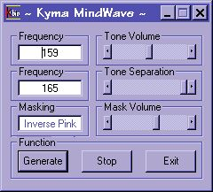



## MindWave Binaural Beat Generator

### Description

The MindWave Binaural Beat Generator for synchronizing your brainwave to Delta, Theta or Alpha states. Generates Sine waves to within 0.1 Hz and incorporates Pink Noise masking to enhance the brainwave entrainment effect. Requires DirectX8 but could be modified easily for use with DirectX7.
 
### More Info
 

             |
---                |---
**Submitted On**   |2002-02-22 20:29:48
**By**             |[Michael Hebert](https://github.com/Planet-Source-Code/PSCIndex/blob/master/ByAuthor/michael-hebert.md)
**Level**          |Beginner
**User Rating**    |4.8 (43 globes from 9 users)
**Compatibility**  |VB 6\.0
**Category**       |[Sound/MP3](https://github.com/Planet-Source-Code/PSCIndex/blob/master/ByCategory/sound-mp3__1-45.md)
**World**          |[Visual Basic](https://github.com/Planet-Source-Code/PSCIndex/blob/master/ByWorld/visual-basic.md)
**Archive File**   |[MindWave\_B569602232002\.zip](https://github.com/Planet-Source-Code/michael-hebert-mindwave-binaural-beat-generator__1-32050/archive/master.zip)

